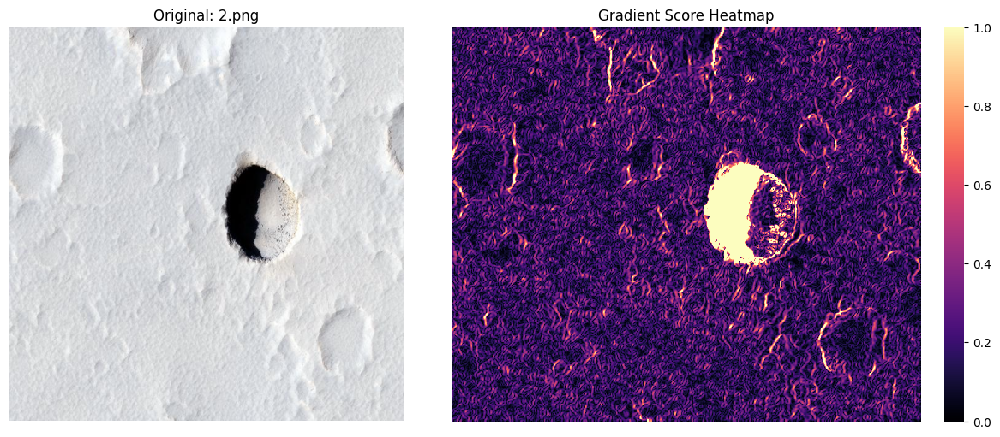
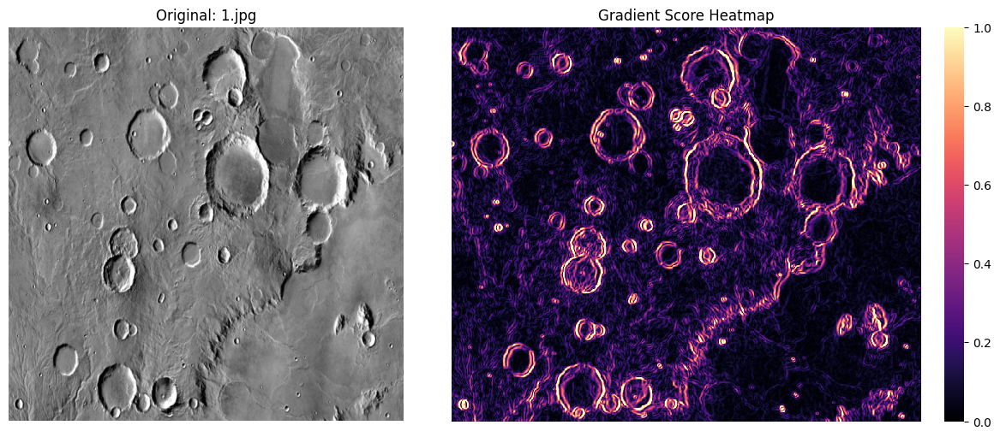

# Detecting Unsafe Surfaces on Extraterrestrial Surfaces using Computer Vision

This Program tries to mark each pixel with a safety score to detect Cliffs, Shadows, Craters, etc. which are unsafe to land on for a Space Rover. We do this using a 2 Step Process:

- Gradient Scoring
- Contouring for Large Shadows

## Gradient Scoring
We calculate the Sobel Gradients of each Pixel using a Kernel Size of 3 and Blurring Kernel Size of 5.

$$ g(x, y) = \sqrt{I_x^2 + I_y^2} $$

$$ G(x, y) = \min \left( 1,\ \frac{g(x, y)}{g_{99}} \right) $$

## Contouring for finding Large Shadows
The Algorithm was ignoring Large Shadows and would mark it as safe even though these were part of craters or cliffs. We used Contouring and tried to find areas with very dark pixels of area >= 500 pixels. This sufficiently marked large unsafe areas as small shadow areas were marked as unsafe by gradient scoring already.

## Sample Results

