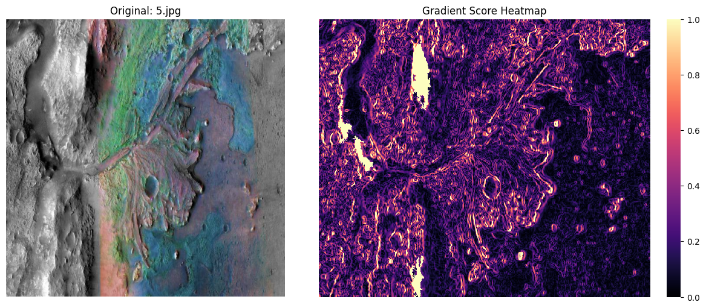
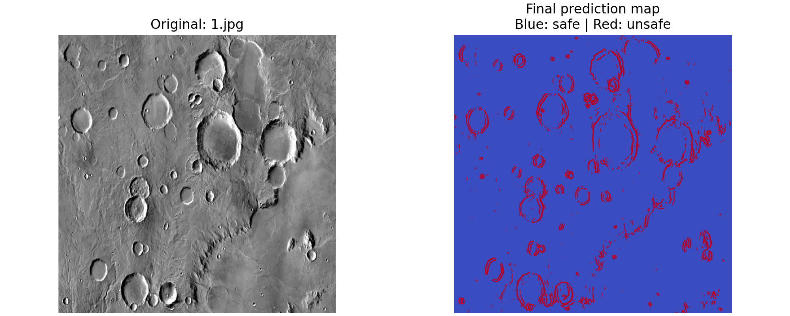
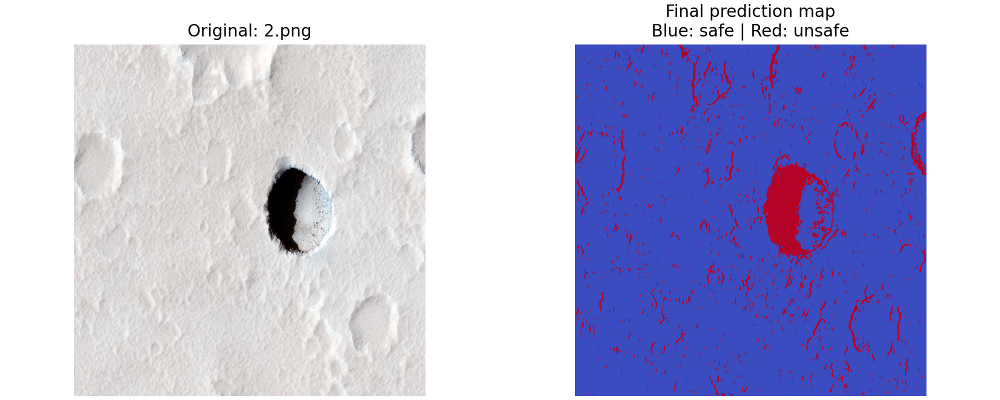
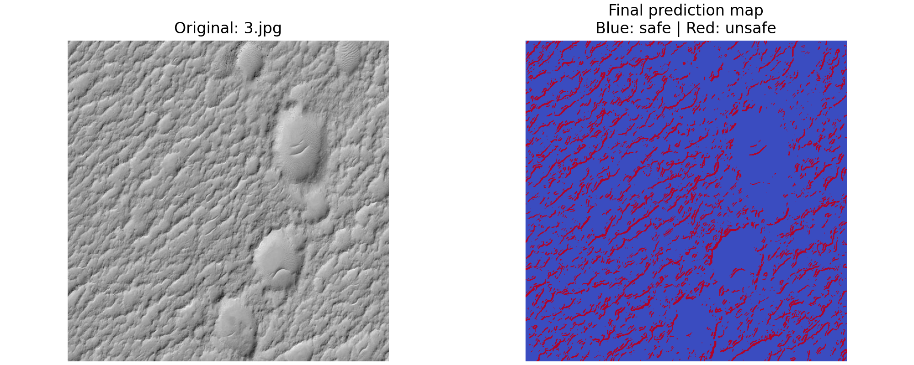
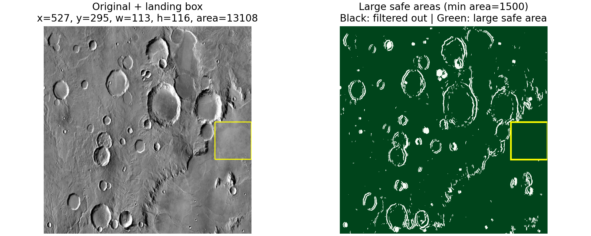
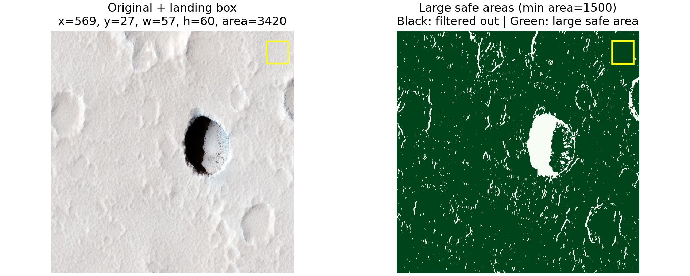
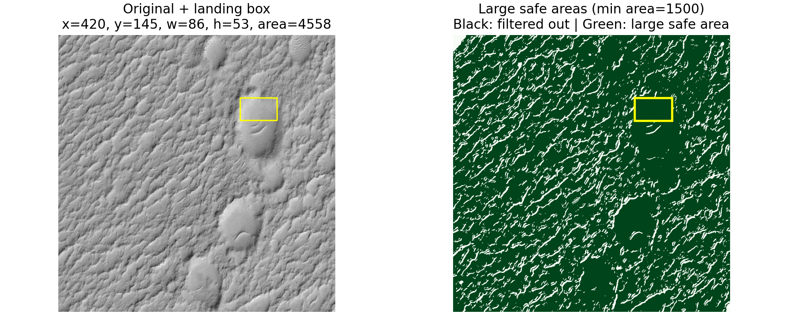

# Detecting Safe and Unsafe Mars Landing Surfaces

This project estimates rover landing safety from orbital/surface imagery using lightweight computer vision methods.

The full integrated pipeline is implemented in [FullPipeline/main.py](FullPipeline/main.py).

## Pipeline Overview

The current flow combines three signals:

1. Gradient risk map (slope and edge intensity)
2. Large-shadow contour masking (dark, unsafe regions)
3. FFT texture classification (soft vs hard terrain)

From these, the pipeline creates:

1. A per-pixel safe/unsafe map
2. A large connected-safe-areas mask
3. The largest all-safe rectangular landing box (guaranteed to contain only safe pixels)

## Part 1: Gradient-Based Risk

Gradient scoring uses Sobel derivatives after Gaussian blur.

$$
g(x, y) = \sqrt{I_x^2 + I_y^2}
$$

$$
G(x, y) = \min \left(1, \frac{g(x, y)}{g_{99}}\right)
$$

where $g_{99}$ is the 99th percentile of non-zero gradient magnitudes.

Large dark contours are additionally marked unsafe to catch shadowed crater/cliff regions.

## Part 2: Surface Hardness via FFT

Terrain is classified block-wise (default 32x32) as hard or soft using frequency-energy ratio from FFT magnitude:

1. Compute high-frequency energy outside a radius
2. Compute low-frequency energy inside the radius
3. Classify with high/low ratio threshold

This produces a hard/soft terrain prediction map.

### 2.4 Prediction Map Fusion

The FFT terrain map is combined with the gradient risk map to form the final safe/unsafe prediction map. Each pixel gets a safe score from slope safety and terrain type, and pixels above the threshold are marked safe for later area extraction.

## Part 3: Final Safe Map and Landing Box

The final safe score combines slope safety and terrain probability:

$$
safe\_score = (1 - gradient\_risk) \cdot terrain\_probability
$$

Pixels above the threshold are marked safe.

Then:

1. Connected components extract large safe regions (minimum area configurable).
2. A maximal-rectangle algorithm finds the largest axis-aligned rectangle made entirely of safe pixels.

This final rectangle is the recommended landing box for the rover.

## Running the Full Pipeline

From the project root:

```bash
python FullPipeline/main.py
```

Or from inside [FullPipeline](FullPipeline):

```bash
python main.py
```

### Useful Arguments

```bash
python FullPipeline/main.py --safe-threshold 0.35 --large-safe-min-area 1500
```

1. --safe-threshold: minimum safe score for a pixel to be marked safe
2. --large-safe-min-area: minimum connected safe region area retained in the large-safe mask

## Outputs

Saved output images are currently organized as:

1. [PredictionMaps](PredictionMaps) for safe/unsafe prediction-map outputs
2. [FinalSafeAreaImages](FinalSafeAreaImages) for final landing-safe-area visualizations

Each visual output currently shows:

1. Original image with largest all-safe landing box overlaid
2. Large connected safe-area mask with the same landing box overlaid

The script also prints landing box coordinates and area for each processed image:

1. x, y: top-left corner
2. w, h: rectangle width and height
3. area: $w \times h$

## Existing Sample Figures

Gradient-scoring examples:




FFT terrain-classification example:


Prediction-map examples:





Final safe-area examples:





## Citations

[1] J. He, H. Cui, and J. Feng, "Edge information based crater detection and matching for lunar exploration," in Proc. International Conference on Intelligent Control and Information Processing, Dalian, China, Aug. 13-15, 2010, pp. 302-307.

[2] M. Gargouri-Motlagh, F. Sadeghi, A. Ashtari, and M. A. Smirnov, "Hardness-dependent surface roughness threshold governing rolling contact fatigue crack initiation," Int. J. Mech. Sci., vol. 309, p. 11020, 2025, doi: 10.1016/j.ijmecsci.2025.11020.